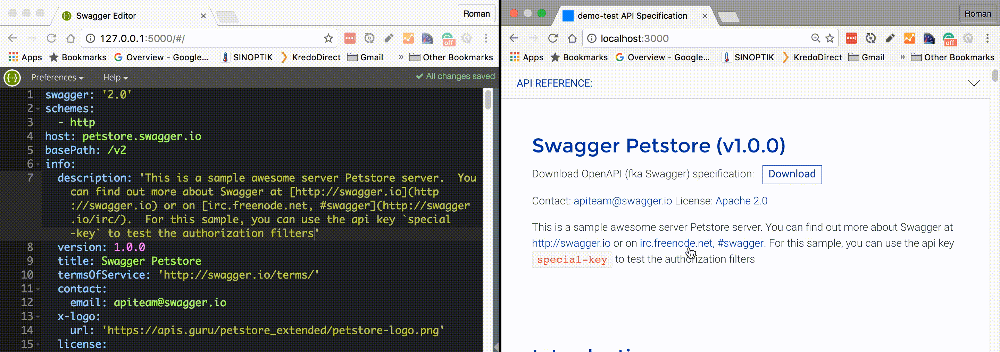

# create-openapi-repo [![NPM version][npm-image]][npm-url] [![Dependency Status][daviddm-image]][daviddm-url]
> Generator for OpenAPI(fka Swagger) repository

<center>


</center>

## Why?
There are a few advantages in hosting your API specification + docs on GitHub:
 - Community engagement (PR's and issues)
 - Hosting on GitHub pages (perfect uptime, CDN, Jekyll, custom domains with CNAME)
 - Advertisment in the GitHub community
 - Revision history, branching, CI
 - Fast on-boarding time (everyone knows how to use GitHub :smile:)

## Features
This generator helps to create a GitHub repo with the following features:
 - Possibility to split a big Swagger spec into smaller files and bundle it for deployment
 - Continuous integration/deployment on Travis
 - Code samples as separate files
 - Swagger spec is validated after each commit
 - Swagger spec + ReDoc deployed to Github Pages (you can use a custom domain)
 - Live editing in your editor or `swagger-editor` :heart_eyes:
 

## Examples of generated repositories
- https://github.com/Rebilly/RebillyAPI
- https://github.com/thingful/openapi-spec
- https://github.com/TwineHealth/TwineDeveloperDocs

## How to generate your repository

We assume you already have [node.js](https://nodejs.org/) installed.

- Install `create-openapi-repo` globally:
```bash
npm install -g create-openapi-repo
```
or use [`npx`](https://medium.com/@maybekatz/introducing-npx-an-npm-package-runner-55f7d4bd282b):

```bash
npx create-openapi-repo <spec-root>
```
- [Create GitHub repo](https://help.github.com/articles/create-a-repo/#create-a-new-repository-on-github) where your OpenAPI spec will live.
- [Clone your repo](https://help.github.com/articles/cloning-a-repository/) and execute the following command inside it:
```bash
create-openapi-repo .
```
-  Commit and push your changes to the GitHub and follow instruction from `README.md` of your newly created repo.

[npm-image]: https://badge.fury.io/js/generator-openapi-repo.svg
[npm-url]: https://npmjs.org/package/generator-openapi-repo
[daviddm-image]: https://david-dm.org/Rebilly/generator-openapi-repo.svg?theme=shields.io
[daviddm-url]: https://david-dm.org/Rebilly/generator-openapi-repo
